# Capstone Project

## Chaos Cards | Full Stack Web Application

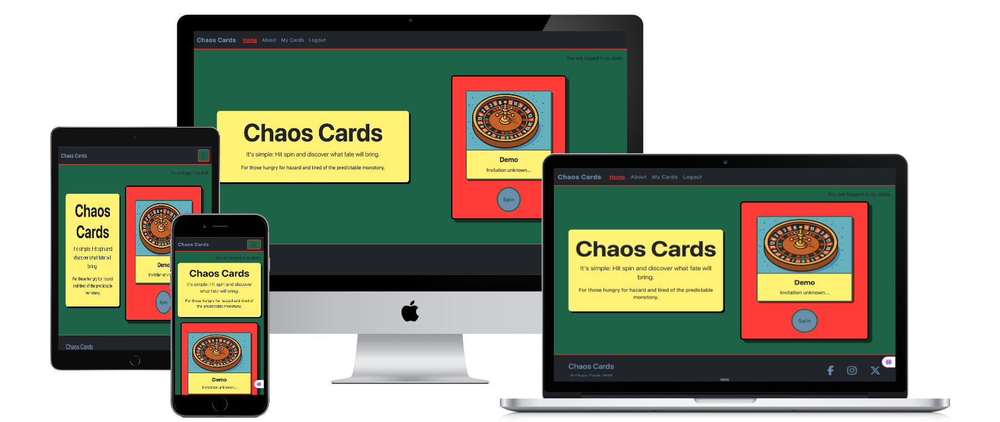

**Author:** James Jarvis-Bicknell

**This project was developed as part of my 16-week full-stack software development bootcamp with Code Institute. It brings together what we have learned: front-end (HTML, CSS, Bootstrap, JavaScript) and back-end (Python, Django).**

## Introduction

**Chaos Cards**

is a Django-powered web application designed to inject unpredictability into daily life.
It allows users to create, edit, delete, and spin random “chaos cards” — each containing an activity or challenge.

The project was built as a full-stack application with the aim of:

- Encouraging spontaneity and playfulness
- Demonstrating CRUD (Create, Read, Update, Delete) functionality
- Exploring user authentication and personalized content
- Providing a responsive, accessible, and engaging user experience

**Intended Audience:**

Anyone looking to break free from routine — from thrill-seekers to bored office workers, procrastinators, creatives, and people simply wanting something new to do.

**Core Functionality**

- User registration and login/logout
- Creating, reading, editing, and deleting personal chaos cards
- Viewing all cards created across the platform
- Spinning a virtual “wheel of chaos” to select a random card
- Contact/feedback submission form

**Technologies Used:**

- Frontend: HTML5, CSS3, Bootstrap 5, JavaScript (ES6)
- Backend: Python 3, Django 5
- Database: PostgreSQL
- Hosting: Heroku
- Static & Media Storage: Cloudinary
- Version Control: Git & GitHub

Click link to see [**live project**](https://chaos-cards-de954de9fb2a.herokuapp.com/)

## Table of Contents:

1. [Introduction](#introduction)
2. [UX Design](#ux-design)
    - [Design Rationale](#design-rationale)
    - [User Stories](#user-stories)
    - [Wireframes](#wireframes)
    - [Database Design](database-design)
3. [Key Features](#key-features)
4. [Deployment](#deployment)
5. [AI Implementation](#ai-implementation)
6. [Testing](#testing)
7. [Future Enhancements](#future-enhancements)
8. [Credits](#credits)

## UX Design:

### Design Rationale

- **Layout:**
    Built for clarity and responsiveness. Navigation is persistent across pages, with clear CTAs for logging in, creating cards, and spinning the chaos wheel.
- **Colour Scheme:**
    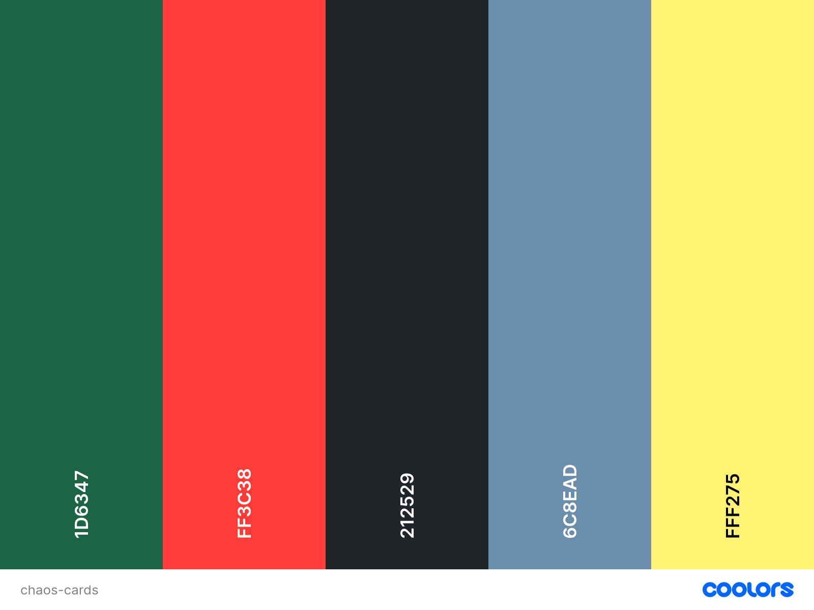
    A vibrant yet minimal palette to balance playful chaos with readability. Bright accent colours highlight interactive elements. Dark green was chosen as the dominant background color as it was evocative of 'games' tables, gambling and chance - which was the theme of the website.
- **Typography:**
    Clean, legible sans-serif fonts with varying weights for hierarchy.
- **Accessibility:**
    - Semantic HTML
    - ARIA labels for interactive components
    - Sufficient colour contrast
    - Fully responsive design for mobile, tablet and desktop
- **Images:**
    - Default images were AI generated using [Microsoft Copilot](https://copilot.microsoft.com/).
    - Image files were formatted, resized and compressed using [Squoosh](https://squoosh.app/) image optimisation software.

### User Stories:

**User Story: View Home Page**

As a user,
I would like to view a homepage with a site description and purpose so that I can understand what Chaos Cards is and how to use it

Acceptance Criteria:
- The homepage must contain a site description, purpose, and navigation links.

Tasks:
- Create home.html
- Add static content
- Add navigation header and footer
- Test for accessibility

**User Story: Register for an Account**

As a user,
I would like to register for an account so that I can create, view, and manage my own cards

Acceptance Criteria:
- Registration form must validate inputs and create user accounts.

Tasks:
- Build Django registration view
- Add form validation
- Style form with crispy-forms
- Connect to user model
- Redirect on success

**User Story: Log In and Out**

As a user,
I would like to log in and log out so that I can securely access and manage my content

Acceptance Criteria:
- Login/logout links visible
- Conditional content rendered based on login state

Tasks:
- Implement Django login/logout
- Update header/footer to reflect auth status
- Test login flow

**User Story: Create Activity Card**

As a user,
I would like to create a new card with a title, description, and optional image so that I can save activities I want to do

Acceptance Criteria:
- Card form must allow title, description, and optional image upload

Tasks:
- Set up card model
- Create form with validation
- Integrate Cloudinary
- Build view and template

**User Story: Edit Activity Card**

As a user,
I would like to edit an existing card so that I can update my activity information

Acceptance Criteria:
- Edit page prepopulates card fields and saves changes on submit

Tasks:
- Create update view
- Reuse form
- Protect route via login
- Test for success messages

**User Story: Delete Activity Card**

As a user,
I would like to delete one of my cards so that I can remove outdated or unwanted activities

Acceptance Criteria:
- Delete option is only available to the card owner
- Confirmation is required

Tasks:
- Add delete view
- Protect via login
- Add confirmation modal or page

**User Story: View All My Cards**

As a user,
I would like to view all the cards I’ve created so that I can see my personal activity list

Acceptance Criteria:
- Only logged-in user’s cards are shown on their dashboard

Tasks:
- Filter cards by user
- Display in a list
- Add links to edit/delete

**User Story: Play the Chaos Card Game**

As a user,
I would like to press a "spin" button to get a random card so that I can choose a fun activity to do

Acceptance Criteria:
- Random card is shown after pressing spin
- Card shows title, description, and image

Tasks:
- Create "game" page
- Add JS or view logic to select a random card
- Style for UX

**User Story: See Login Status Across Pages**

As a user,
I would like to see whether I am logged in or not on every page so that I can know what actions I can take

Acceptance Criteria:
- Header reflects login state on all pages

Tasks:
- Add auth conditionals to base.html
- Style header with avatar/logout or login/register

**User Story: Admin Access**

As a superuser,
I would like to access the Django admin panel so that I can manage site content and users

Acceptance Criteria:
- Only superusers can access the admin route

Tasks:
- Enable admin in urls.py
- Register models
- Create superuser
- Test access

**User Story: Form Validation**

As a user,
I would like to receive clear error messages when submitting invalid forms so that I can easily fix mistakes

Acceptance Criteria:
- Form errors are displayed inline with helpful messages

Tasks:
- Use Django form validation
- Customize error messages
- Test common invalid inputs

**User Story: Notifications for Data Changes**

As a user,
I would like to receive confirmation when I create, edit, or delete a card so that I can know my actions were successful

Acceptance Criteria:
- Messages are shown after successful or failed actions

Tasks:
- Use Django messages framework
- Style alerts
- Display on relevant pages

### Wireframes:

The basic structure for Chaos Cards was worked out using the wireframe software [BALSAMIQ](https://balsamiq.com/), to guide design choices when developing. Over the project, the design changed and new sections were incorporated. Wireframes for desktop and mobile views were created.

**Desktop View**
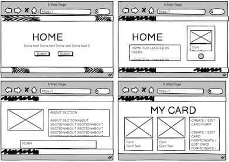

**Mobile View**
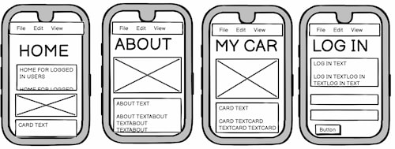

### Database Design

An **Entity Relationship Diagram (ERD)** was planned and created to visualise the database, the different tables and their fields, and the relationships between tables before any development begun. The diagramming tool [Lucid Chart](https://www.lucidchart.com/) was used for this.

My project involved a simple database structure with 4 models:

- **User**
    The user was related to the cards in a one-to-many relationship. The user was also related to about in a one-to-one relationship. Only the superuser can create an about section.
- **Card**
    The card was related to the user in a many-to-one relationship.
- **About**
    The about section was related to the user in a one-to-one relationship.
- **Contact / Feedback**
    The contact / feedback model was unrelated to any of the other models. Anyone could use the contact form regardless of whether they are a registered user.

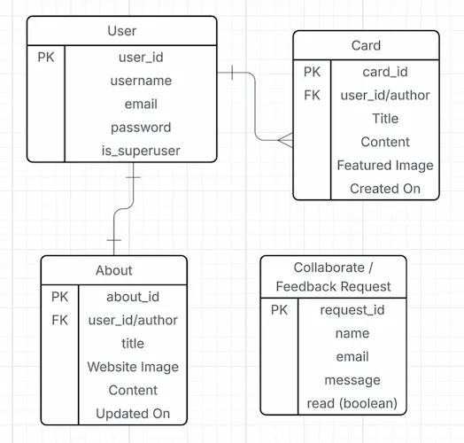

## Key Features:

- **User Authentication:**
    Registration, login/logout, password management via Django’s built-in auth system.
- **Card Management:**
    Full CRUD functionality
        - Each registered user can create their own cards.
        - Each registered user can edit their own cards.
        - Each registered users can delete their own cards.
        - Users cannot see, edit or delete other users' cards.

    The superuser has full CRUD capabilities across users from the admin panel.
- **All Cards View:**
    Each user can see all of the cards which they have created.
- **Chaos Wheel:**
    Each registered user can play the *Chaos Cards* game.
    If a user is registered, they can 'spin the wheel of chaos', and a random card from the user's collection will be selected and displayed to them.
    If the user has not yet created their own cards and tries to play the game, an informative message will be displayed and they are directed towards the 'Create Cards' page so that they can play.
- **Contact Form:**
    Users can send feedback or queries, which is stored in the database and accessible in the admin panel.
- **Responsive Design:**
    Works seamlessly across devices and screen sizes.

## Deployment

**Hosting:** The project is deployed on [Heroku](https://www.heroku.com/) with a PostgreSQL database.

**Steps to Deploy:**
1. Create a new Heroku app
2. Initialise PostgreSQL database
3. Configure environment variables in Heroku Settings:
    - DATABASE_URL
    - SECRET_KEY
    - CLOUDINARY_URL
4. Virtual python environment created to install all dependencies for project.
5. Ensure DEBUG set to False when in production
6. Push code to GitHub and connect repo to Heroku
7. Deploy website manually from Heroku

**Security Considerations:**
- ALl sensitive keys stored in environment variables (and kept out of publically published code)
- Debug mode disabled in production
- Allowed hosts restricted to Heroku domain and custom domains

## AI Implementation:

**Use Cases:**

- Generating user stories
- Idea generation for user cards during development/testing
- Assistance with Django view logic and template refactoring
- Bug identification and optimisation suggestions

**Reflections:**

- AI accelerated development by providing quick references and boilerplate code
- Best results came when combining AI assistance with manual debugging and documentation reading

## Testing:

**Manual Testing:**

- Tested across Chrome, Firefox, Safari, and Edge
- Mobile responsiveness tested on multiple devices and simulated in DevTools
- Functional testing of all CRUD operations and wheel spin feature

**Automated Testing:**

- Django unit tests for views and models

**Performance Testing:**

Lighthouse tests were run on each separate web page of the web application for performance, accessibility, best practice and SEO.

Initial lighthouse tests scored poorly on accessibility and best practices for the following reasons:

- Poor contrast between background and foreground
- Missing aria-labels
- Non-sequentially descending order of heading elements
- Cloudinary was returning images with insecure URLs (http://)

It was easy to resolve the first three issues through changing the colour scheme and styling, inserting aria-labels where needed, and ensuring the heading elements followed a sequentially descending order.

The Cloudinary issue was more difficult to resolve. Cloudinary was not automatically generating secure URL links for images which was causing performance and security issues.

I tried various solutions, such as adding the following code to my settings.py file:

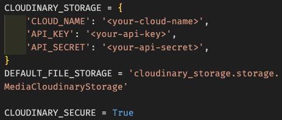
(*With my own cloud name, api key and api secret inserted*)

I also tried inserting security into the Django templates. However, none of this worked. In the end I resorted to hard coding https onto the front of the URLs in the templates and slicing the *http://* off. This has worked although it is a temporary solution.

### Lighthouse Test Results:

**Logged-in Home:**
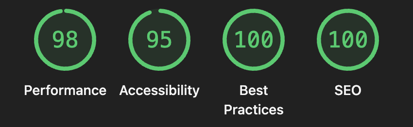

**Logged-out Home:**

**About Page:**
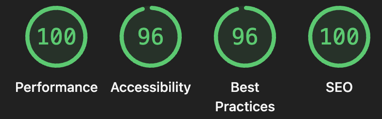

**My Cards Page:**
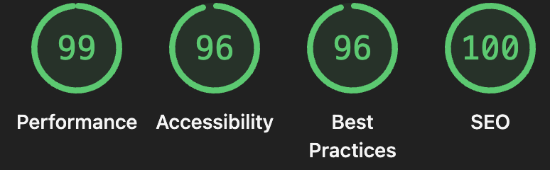

**Registration Page:**
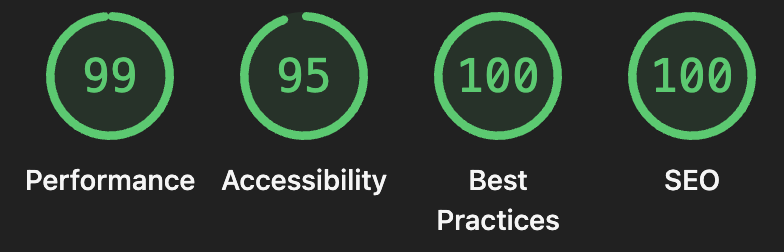

**Log-in Page:**
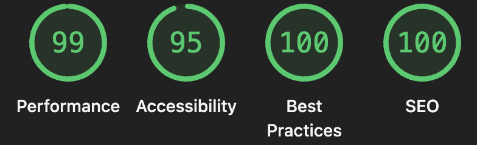

**Log-out Page:**

### Code Validation:

**HTML Validation:**

I used the [W3C HTML Validator](https://validator.w3.org/) for code validation.

Results for all pages:

**CSS Validation:**

I used the [W3C CSS Validator](https://jigsaw.w3.org/css-validator/) for code validation.

Results:

**Python:**

Checked for PEP8 compliance with Flake8.

**JavaScript:**

Used JS Hint.

## Future Enhancements:

- Deck Management: Organise cards into decks with tagging
- Ratings & Comments: Let users rate and comment on public cards
- User Profiles & Stats: Track how often a user spins the wheel or completes cards
- Social Sharing: Share chaos cards directly to social media
- AI-Generated Cards: Suggest chaos ideas based on user interests

## Credits

**Frameworks & Tools:** Django, Bootstrap, Cloudinary, Heroku, GitHub
**Icons:** Font Awesome
**Testing Resources:** W3C validators, Lighthouse, Flake8
**Code Institute:** All the teachers, support and resources.
